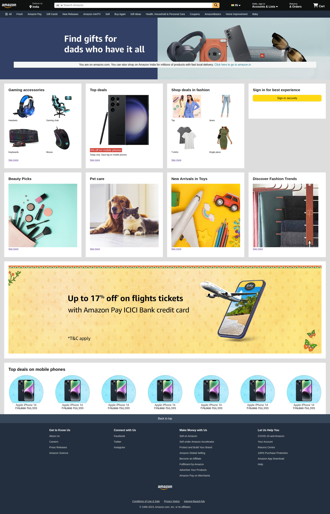

# amazon-clone
I've made this clone of Amazon using raw HTML & CSS only without any framework.

This project showcases the designing abilities and frontend skills.

[ Also checkout my "food-order-app" ( <a href="https://harsh-sahni-projects.github.io/food-order-app/">Live</a> | <a href="https://github.com/harsh-sahni-projects/food-order-app" target="_blank">Code</a> ) which I made using ReactJS ]

 

