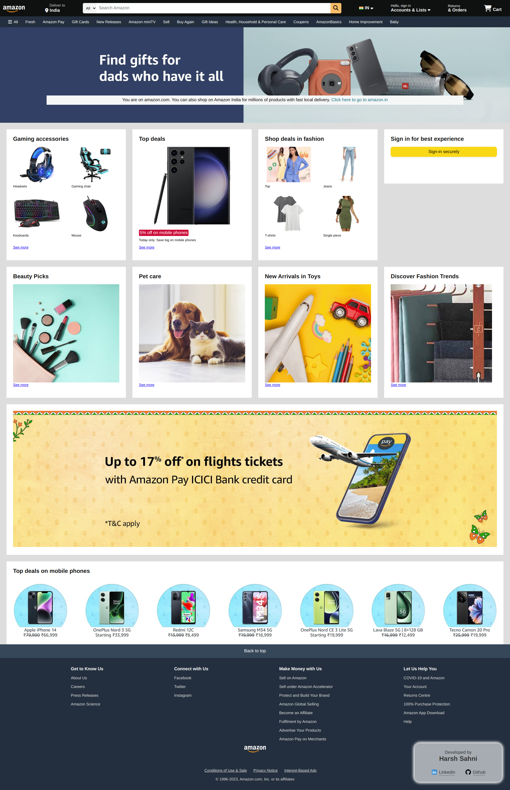

# amazon-clone
I've made this clone of Amazon using raw HTML & CSS only without any framework.

This project showcases the designing abilities and frontend skills.

[ Also checkout my "food-order-app" ( <a href="https://harsh-sahni-projects.github.io/food-order-app/">Live</a> | <a href="https://github.com/harsh-sahni-projects/food-order-app" target="_blank">Code</a> ) which I made using ReactJS ]

#### Contact 

For business inquires, lets chat on <a href="https://www.linkedin.com/in/harsh-sahni" target="_blank">LinkedIn</a>

(If you want learn more about me, lets connect on linkedin)

## Below is the screenshot of how this clone looks on Desktop

 

 

## Mobile view

 

